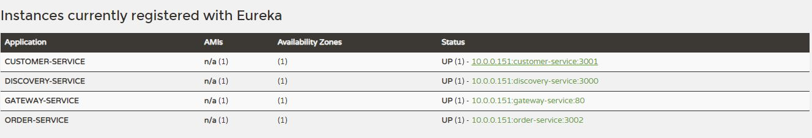

# spring-microservices

Developing a microservices architecture uisng Spring-boot, Maven and Netflix-Eureka server

## Two microservices:
CustomerService : Contain endpoints of getting all customers, and also a particular customer.  
OrderService : Contain endpoints of getting all orders, and also a particular order.

Both the microservices will connect and communicate with each other using Eureka server

If all the things work properly, you can see the services running on Eureka server  

